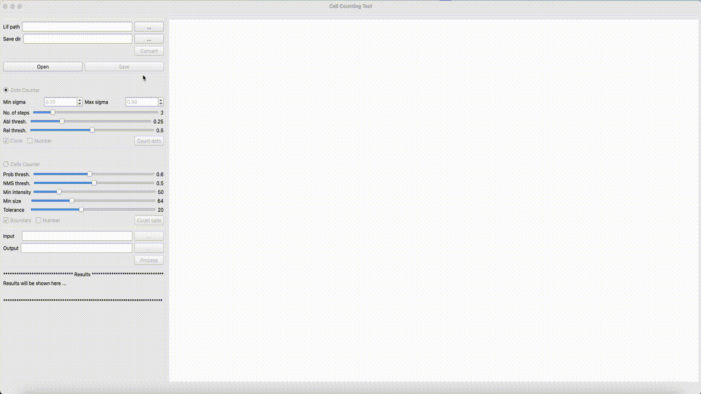

# Dot/Cell Counting Tool

A GUI application for automated or semi-automated dot and cell counting in microscopy images. This tool provides functionality for both individual image analysis and batch processing.

## Features

- Convert .lif files to individual images
- Automated or Semi-Automated dot detection and counting
- Automated or Semi-Automated cell detection and counting
- Batch processing capabilities
- Interactive GUI with manual refinement
- Results display and export

## Installation and Setup

### Prerequisites

- Anaconda or Miniconda installed on your system
- Python 3.8 or higher

### Environment Setup

1. Clone this repository:
```bash
git clone https://github.com/lxfhfut/CCT.git
cd CCT
```

2. Create a new conda environment:
```bash
conda env create -f cell_count.yml
```

Alternatively, if you are on MacOS:
```bash
conda env create -f cell_count_mac.yml
```

3. Activate the environment:
```bash
conda activate cell_count
```

4. Run the program:
```bash
python ./GUI/main.py
```

## Usage Guide

### Basic Operations

1. **Converting .lif Files**
   - Enter the .lif file path or use the browse button
   - Select save directory for converted images
   - Click "Convert" to process the file
   - Dots and Cells images will be saved in "Dots" and "Cells" folders, respectively.  
   
   **Image Compatibility**  
	✓ Grayscale images  
	✓ Color (RGB) images  
	
	**Counting dots on a merged image is often easier, as only the dots associated with cells are of interest. In such combined analysis, make sure to place dots in the red channel and cells in the blue channel.**
	
   

2. **Dot Counting**
   - Select "Dots Counter" radio button
   - Adjust parameters:
     - Min/Max sigma for dots of varying size 
     - Number of steps
     - Absolute and relative thresholds
   - Click "Count dots" to process
   
     

3. **Cell Counting**
   - Select "Cells Counter" radio button
   - Adjust parameters:
     - Probability threshold
     - NMS threshold
     - Minimum intensity
     - Minimum size
   - Click "Count cells" to process
   - Use the mouse to refine the counting of dots and cells: left-click to add a missed dot or cell, and right-click to remove a falsely detected dot or cell. Adjust the 'Tolerance' parameter to achieve a more accurate cell boundary.
   
   

4. **Batch Processing**
   - Select "Dots Counter" or "Cells Counter" radio button
   - Experiment parameters that work best for your image
   - Select input directory containing images
   - Choose output directory for results
   - Click "Process" to start batch analysis with the selected parameters
   
   **The counting results are included in the file name of the saved image and are also exported to a separated CSV file.**
   
   
 
   

## Notes

- When processing large images with dense cells, allow some time for the analysis to complete
- Some operations can be time-consuming, so after adjusting the relevant parameters, the user is required to click "Count cells" to update the counting result.

## Contact

[Gavin Lin](mailto:x.lin@garvan.org.au)
